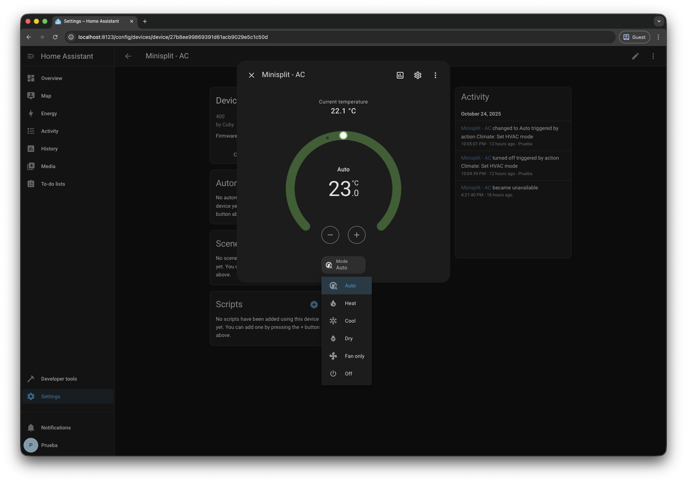

# Cuby AC – Home Assistant Integration (API v2)



> Custom Home Assistant integration for **Cuby Smart AC Controllers**, built for the official **Cuby Cloud API v2**.  
> This integration adds your Cuby-connected A/C units as **native climate entities** within Home Assistant.

---

## 🌐 Overview
> I was **frustrated** because the company that sold me the minisplit didn't have the USB to make it Wi-Fi compatible. 
> I bought the Cuby AC thinking I would connect it to the internet, but I don't want to use a different app for each brand of device in my house. 
> I discovered that there was no functional repository for this device, so, like any good crazy programmer, I started developing one (obviously with the help of my ever-faithful friend ChatGPT).

This custom component allows you to control your **Cuby Smart A/C** devices directly from Home Assistant using the official **Cuby Cloud API v2**.

Once configured, your Cuby devices appear under **Devices & Entities**, allowing you to:

- Turn your A/C **on/off**
- Set **target temperature**
- Change **operation mode** (Cool, Heat, Dry, Fan, Auto)
- Monitor **current temperature** and **status**
- Choose whether to display temperatures in **Celsius or Fahrenheit**
- Automatically refresh device states via **DataUpdateCoordinator**

Tokens are stored securely and remain valid for **365 days**, minimizing re-authentication.

---

## ⚙️ Installation

### Option 1 — Add via HACS (recommended)
1. In HACS, go to **Integrations → Custom repositories**.
2. Add this repository: `https://github.com/soySantosPerez/cuby-ac` into Category: **Integration**
3. Search for **Cuby AC**, install it, and restart Home Assistant.
4. Add the integration from the UI as described below.

### Option 2 — Manual installation

1. Copy the `cuby_ac` folder into: `config/custom_components/`
2. Restart Home Assistant.
3. Go to **Settings → Devices & Services → + Add Integration → Cuby AC**.
4. Enter your **Cuby account email and password**.
5. Select the devices you want to add.

---

## 🔑 Authentication

- The integration requests an **API token** from: `https://cuby.cloud/api/v2/token/{user}`
- The token is valid for **365 days** (31,536,000 seconds).
- If the token expires or becomes invalid, you’ll be prompted to log in again.

---

## 🧠 Technical Details

- Uses **aiohttp** via Home Assistant’s built-in `async_get_clientsession`
- API endpoints:
- `POST /token/{user}` — authentication
- `GET /devices` — list available devices
- `GET /devices/{id}?getState=true` — detailed state
- `POST /state/{id}` — send control commands
- Polling and error handling are managed with `DataUpdateCoordinator`
- Supports **multiple devices per account**
- Supports Home Assistant **Options Flow** for:
- Device selection
- Temperature unit preference (Follow device / °C / °F)

---

## 🧩 Features Implemented

✅ Cloud authentication (Cuby API v2)  
✅ Token storage (365-day validity)  
✅ Automatic token refresh handling  
✅ Device discovery via `/devices`  
✅ Live state updates via `/devices/{id}?getState=true`  
✅ Power on/off, temperature, and mode control  
✅ Unit selection (device / Celsius / Fahrenheit)  
✅ Config & options flows (UI-based setup)  
✅ Proper device grouping in HA registry  
✅ Logging and debugging with context

---

## 🚧 Known Limitations / TODO

🔲 Add **fan speed** (`low`, `medium`, `high`, `auto`)  
🔲 Add **eco / turbo / display / long** options  
🔲 Add **diagnostics page** for debug info  
🔲 Add **token regeneration** button from the options panel  
🔲 Improve **error handling** for network timeouts  
🔲 Publish to the **HACS default repository index**  
🔲 Add **icons & translations** for other languages  
🔲 Unit tests & CI workflow

---

## 🧰 Troubleshooting

If your devices don’t appear or updates fail:

1. Check logs: `Settings → System → Logs → “Cuby AC”`
2. Look for: **Error adding entity None for domain climate** 
2.1- This usually means an invalid or incomplete API response.
3. If authentication fails:
3.1 Remove the integration.
3.2 Re-add it using your Cuby credentials.
4. If SSL errors appear:
4.1 Make sure the container or host has the `certifi` package updated.
4.2 You can test API connectivity with:
  ```bash
  curl -v https://cuby.cloud/api/v2/devices
  ```
5. Enable debug logging by adding to your `configuration.yaml`:
```yaml
logger:
  default: info
  logs:
    custom_components.cuby_ac: debug
```

---
## 💡 Development Notes
To run in a local Docker environment:
```bash
docker compose up -d
```

### Structure:
```
custom_components/cuby_ac/
├── __init__.py
├── api.py
├── climate.py
├── config_flow.py
├── const.py
├── coordinator.py
├── manifest.json
├── strings.json
└── translations/en.json
```

---
## 🧾 License

This project is released under the MIT License.
Cuby and its related trademarks belong to Cuby Technologies.

---
## 🧊 Author
Developed and maintained by @soySantosPerez
> Contributions, pull requests and feature ideas are welcome!